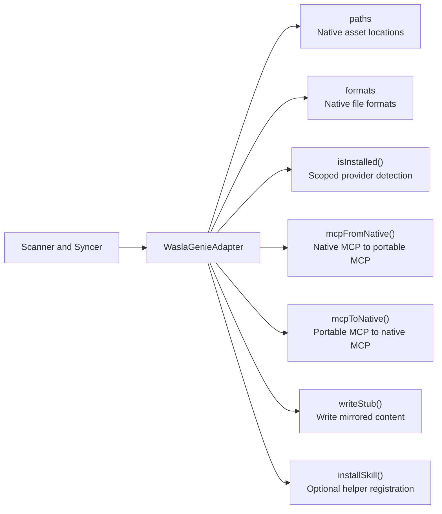

# Writing an Adapter

Adapters isolate provider-specific paths and formats from the synchronization engine. Add adapters under `src/adapters/` and register them in `src/adapters/factory.ts`.

## Adapter Boundary



The current interface lives in `src/core/types.ts`:

```typescript
export interface WaslaGenieAdapter {
  name: string;
  displayName: string;
  paths: {
    agent?: string;
    skill?: string;
    mcp?: string;
    context?: string;
  };
  formats: {
    agent?: AssetFormat;
    skill?: AssetFormat;
    mcp?: AssetFormat;
    context?: AssetFormat;
  };
  mcpKey: string;
  contextFile: string;
  skillDirs: string[];
  isInstalled(): Promise<boolean>;
  mcpFromNative(server: Record<string, unknown>): Record<string, unknown>;
  mcpToNative(server: Record<string, unknown>): Record<string, unknown>;
  writeStub(asset: Asset, content: string, targetPath: string): Promise<void>;
  installSkill(): Promise<void>;
  getRootConfigAppend(): string | null;
}
```

## Implementation Steps

1. Create `src/adapters/<provider>.ts`.
2. Extend `BaseAdapter`.
3. Resolve paths for both `workspace` and `user` scope.
4. Return `undefined` for unsupported asset types.
5. Implement `isInstalled()` using native provider markers.
6. Add MCP transformations when the provider JSON shape differs from the portable shape.
7. Register the adapter in `src/adapters/factory.ts`.
8. Add path, detection, write, and cross-sync tests.
9. Document provider support under `docs/docs/providers/`.

## MCP Translation Example

Core logic works with a portable MCP entry:

```json
{
  "command": "node",
  "args": ["server.js"]
}
```

A provider adapter may transform that into its required native shape:

```json
{
  "type": "stdio",
  "command": "node",
  "args": ["server.js"]
}
```

This keeps provider conditionals out of the `Syncer`.

## Supported Asset Types

Adapters may support any subset of:

| Type | Purpose |
| --- | --- |
| `agent` | Reusable agent instructions. |
| `skill` | Skill directories or skill markdown files. |
| `mcp` | One named MCP server entry from a native JSON config. |
| `context` | Root-level provider instruction file. |

Unsupported types must remain `undefined` in `paths` and `formats`. The sync engine skips them.
