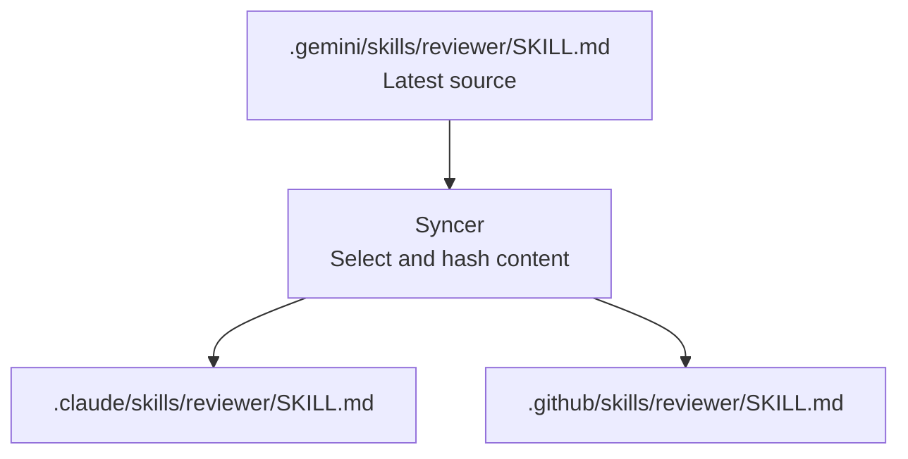
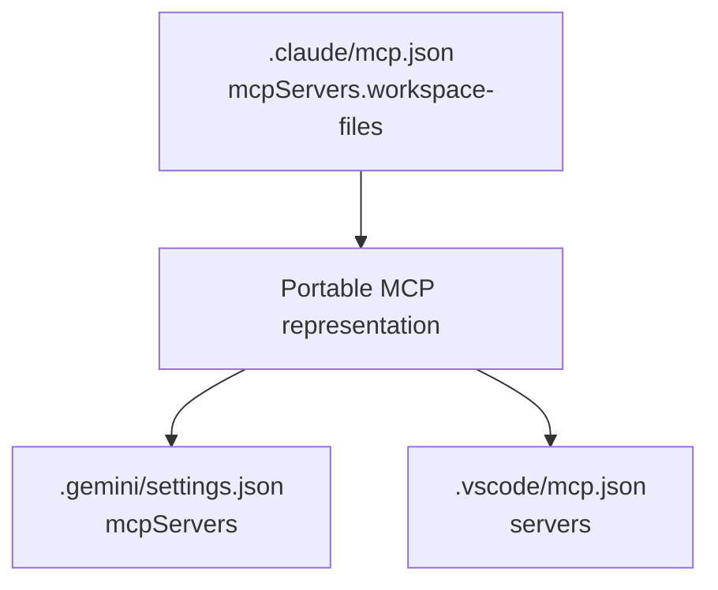

# How Mirroring Works

WaslaGenie mirrors full asset content into each active provider's native location. The registry calls these managed targets `stubs`, but they are usable native files or JSON entries, not references.

## Why Mirror Content?

AI tools do not share one import mechanism. A provider must be able to load an asset even when WaslaGenie is not running. Full-content mirroring satisfies that requirement and keeps provider behavior predictable.

## File Assets

Agents, skills, and context files are written to the location defined by the target adapter.



Directory-based skills keep supporting files alongside `SKILL.md`.

## MCP Assets

MCP servers require structured updates. WaslaGenie parses the provider JSON document, modifies only the named MCP server entry, and writes the JSON document back.



Adapters convert between the portable MCP representation and each provider's native shape.

## Tracking Metadata

Tracking metadata is stored in the scoped registry rather than inserted into user content.

```json
{
  "name": "reviewer",
  "type": "skill",
  "stubs": [
    {
      "tool": "claude",
      "path": "/project/.claude/skills/reviewer/SKILL.md",
      "written_at": "2026-05-31T00:00:00.000Z",
      "hash": "..."
    }
  ]
}
```

Hashes let WaslaGenie distinguish a managed mirror from a mirror that the user edited after synchronization.

## Deletion Reconciliation

When a managed file disappears, WaslaGenie checks surviving mirrors:

1. If a surviving mirror was edited, it is preserved and can become the source.
2. If no surviving mirror changed, managed copies and the canonical cache entry are removed.
3. Files that are not tracked by the registry are never removed by reconciliation.

This keeps deletion behavior conservative.
