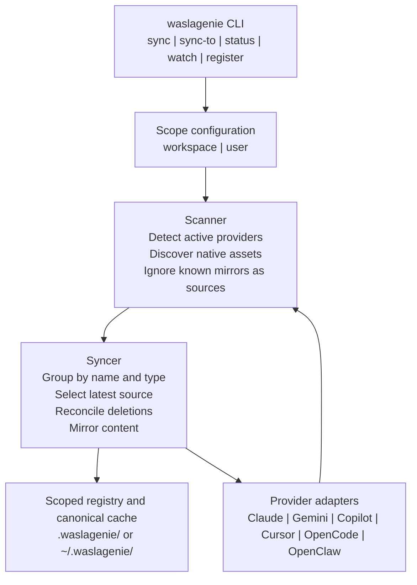
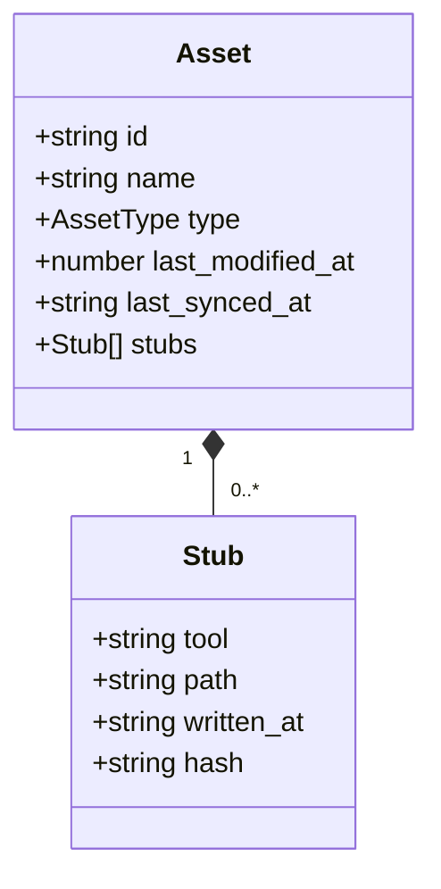

# Architecture Overview

WaslaGenie is a local-first synchronization engine for AI tool assets. It discovers assets in the active providers, selects the latest source, mirrors content into the other active providers, and records the result in a scoped registry.

There is no server and no remote database. The CLI operates on files already used by Claude Code, Gemini CLI, GitHub Copilot, GitHub Copilot CLI, Cursor, OpenCode, and the experimental OpenClaw adapter.

## System Map

## Core Components

| Component | Location | Responsibility |
| --- | --- | --- |
| CLI commands | `apps/cli/src/commands/` | Validate command input, ask for scope where needed, and render terminal output. |
| Scope utilities | `packages/shared/src/config.ts`, `packages/shared/src/paths.ts` | Resolve the selected scope, registry location, and provider markers. |
| Scanner | `packages/sync/src/scanner.ts` | Detect active providers and discover native files or structured MCP entries. |
| Syncer | `packages/sync/src/index.ts` | Select sources, mirror assets, reconcile deletions, and update tracking metadata. |
| Registry | `packages/core/src/registry.ts` | Persist asset metadata, hashes, mirror locations, and conflicts as JSON. |
| Adapters | `packages/adapters/src/` | Translate generic asset operations into provider-specific paths and formats. |
| Visualizer | `apps/visualizer/` | Present registry state in a browser UI without changing sync semantics. |

## Asset Model

An asset is identified by its `name` and `type`.

The registry calls mirrored targets `stubs`, but the target files contain usable content. They are not pointers. MCP assets are stored as individual registry entries even when the provider stores multiple MCP servers in one JSON file.

## Design Rules

1. **Scope is explicit.** Workspace and user registries are separate.
2. **Native files remain usable.** Tools do not need a WaslaGenie runtime to read mirrored assets.
3. **The latest edit wins.** The file with the newest modification time becomes the source during a general sync.
4. **Adapters own provider differences.** Core synchronization logic does not hardcode provider file layouts.
5. **The registry tracks managed mirrors.** Hashes and paths allow deletion reconciliation without deleting unrelated user files.

## Read Next

- [Synchronization Flow](./synchronization-flow.md)
- [Scopes and Registry](./scopes-and-registry.md)
- [How Mirroring Works](./how-stubs-work.md)
- [Writing an Adapter](./adapters.md)
- [Provider Mapping](./orchestrator-comparison.mdx)
