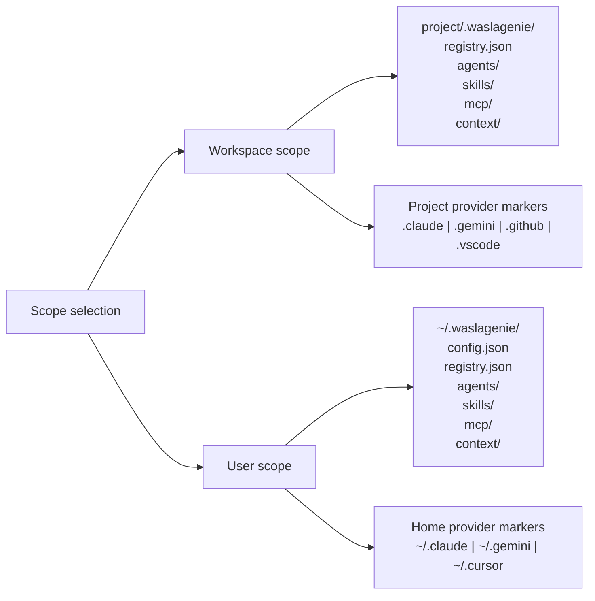
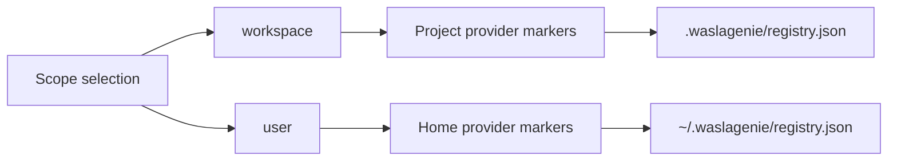

# Scopes and Registry

WaslaGenie supports two independent scopes. The selected scope controls both provider discovery and registry storage.

## Scope Layout

The global preference is stored in `~/.waslagenie/config.json`. Commands resolve the selected registry from that preference. Interactive `waslagenie sync` asks for the scope before scanning.

## Registry Responsibilities

`registry.json` stores:

| Field | Purpose |
| --- | --- |
| `assets` | Known assets and their managed mirror locations. |
| `conflicts` | Multiple original versions detected for the same name and type. |
| `config.scope` | Scope associated with this registry. |
| `config.version` | Registry format version. |

Canonical copies are stored beside the registry under `agents/`, `skills/`, `mcp/`, and `context/`. They provide a local cache of the last synchronized content.

## Provider Discovery Is Scoped

Workspace sync checks project markers such as `.claude`, `.gemini`, `.github`, and `.vscode`. User sync checks home-directory markers such as `~/.claude`, `~/.gemini`, and `~/.cursor`.

A provider installed for the user is intentionally not treated as active during workspace synchronization unless its workspace marker exists.
