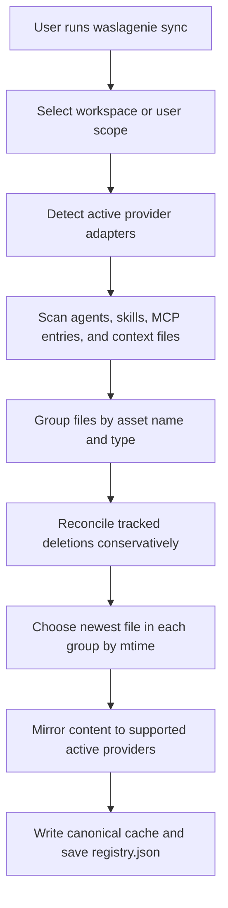
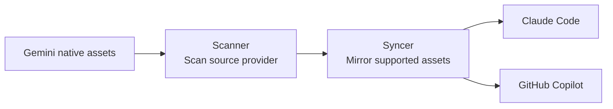

# Synchronization Flow

`waslagenie sync` performs a full multi-provider synchronization. `waslagenie sync-to` uses the same engine with an explicit source and selected targets.

## General Sync



## Source Selection

For a general sync, the source is dynamic:

1. Files are grouped by asset name and type.
2. The group is sorted by modification time.
3. The newest version is selected.
4. For directory-based skills, `SKILL.md` is the primary definition and sibling files are mirrored with it.

This is the **Latest is Greatest** rule. It lets users edit an asset from any supported tool without assigning permanent ownership.

## Targeted Sync

Use targeted sync when direction matters:

```bash
waslagenie sync-to --from gemini --to claude,github-copilot
```



## Status Output

`waslagenie status` reads the registry and detects currently active providers. Normal output only shows mirrors belonging to active providers, so historical entries do not confuse the current workspace view.
